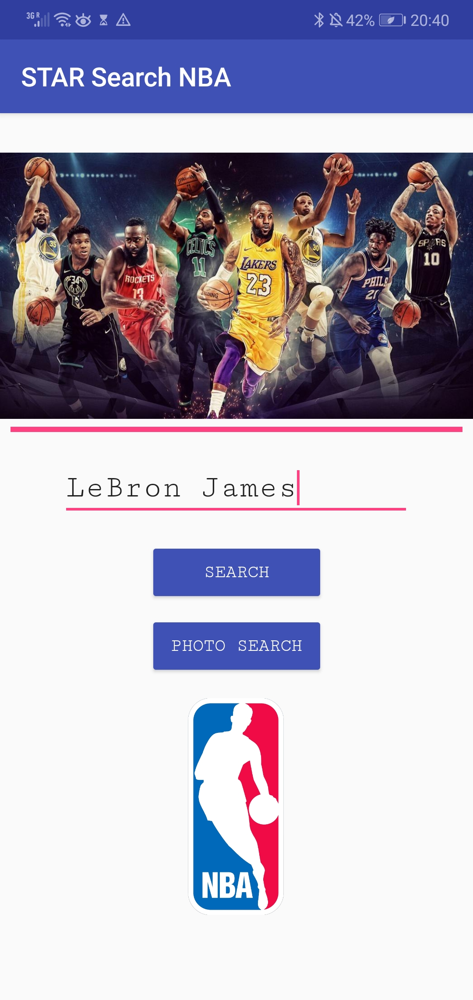

# NBA-Star-Search
An Android app search for NBA players' performance data and videos with modes of name search and photo search. 
This app derives from coure project and uses Face Recognition API provided by Microsoft Azure.

Main Page

Photo Search Page
Choose a photo from library and upload.

Main Page
Back to the main page with player's name extracted.

Data Page
Demonstrate player's bio and performance data. 

Video Page

